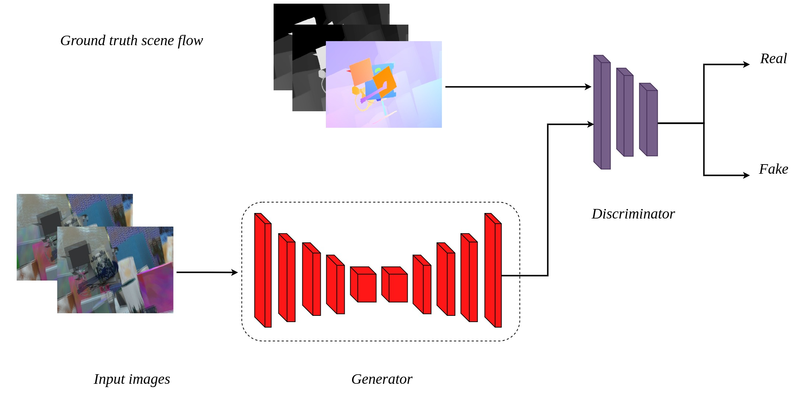

# SceneFlowGAN

This repository contains Keras implementation of our paper 

A Conditional Adversarial Network for Scene Flow Estimation (RO-MAN 2019)

The code has been tested on Ubuntu 16.04 with CUDA 9.0

[Ravi Kumar Thakur](https://ravikt.github.io/) and [Snehasis Mukherjee](https://sites.google.com/a/iiits.in/snehasis-mukherjee/)

## Requirements

Keras 2.1.4

Opencv 3.3.1

## Acknowledgement

We would like to thank [Soumen Ghosh](https://sites.google.com/site/soumenca/) and [Shiv Ram Dubey](https://sites.google.com/site/shivram1987/) for providing support and insightful discussion.

## Reference

Please use the following for citation purpose

    @article{thakur2019conditional,
    title={A Conditional Adversarial Network for Scene Flow Estimation},
    author={Thakur, Ravi Kumar and Mukherjee, Snehasis},
    journal={arXiv preprint arXiv:1904.11163},
    year={2019}
    }
